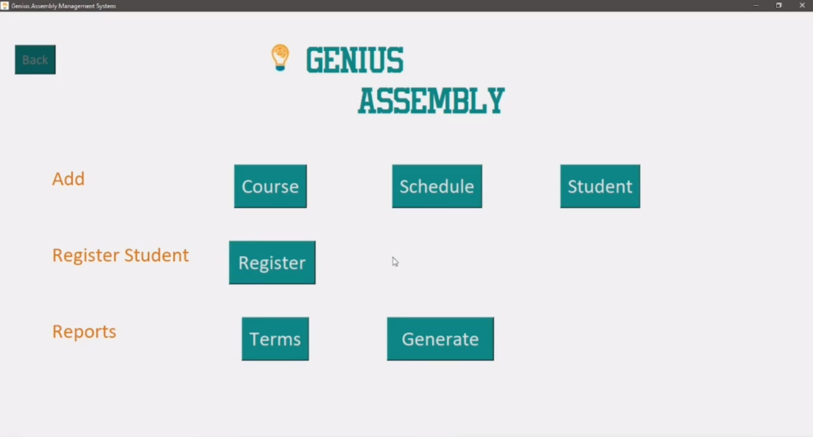

# Course Registration System
> An application that allows instructors to enter details of courses, students and schedules through a GUI and register them. It also allows users to track payments made by students and automatically generates consecutive terms for courses. The application can export these details to a CSV file.

## Table of Contents
* [General Info](#general-information)
* [Technologies Used](#technologies-used)
* [Features](#features)
* [Screenshots](#screenshots)
* [Setup](#setup)
* [Usage](#usage)
* [Project Status](#project-status)
* [Room for Improvement](#room-for-improvement)
* [Acknowledgements](#acknowledgements)
* [Contact](#contact)
<!-- * [License](#license) -->

## General Information
### The Problem
An educational academy in Singapore that runs STEM courses keeps track of all its details (ranging from student and course registrations to payment records) using a spreadsheet. As the academy grows, they have to maintain more records. Thus, using spreadsheets becomes inefficient and cumbersome. It is error prone due to lack of validation, data normalization and there is substantial repetition of information. Overall, the process is time-consuming and tedious.

### Solution
- I proposed to build a desktop application that would be used at a single location.
- I chose to build it in Python because of its active and supportive community. Its OOP functions supported by Tkinter, a powerful object-oriented GUI library, helps in efficient application design and code reusability.
- I proposed to use Random Access Files for quicker access while viewing and generating reports for data persistence. 
- I used Caesar-cipher encryption specifically for the passwords for basic security. 
- I implemented binary search and quicksort algorithms to search for and sort data due to their lower time complexities.

## Technologies Used
### Languages
- Python - version 3.9.1

### Libraries
#### tkinter
An OOP GUI library offering multiple features relevant to this application like Buttons, Dropdowns and EntryBoxes.

#### ttk
A GUI module providing widgets e.g. table widget, that is absent in the original library.

#### tkinter.font
A module used to increase application aesthetics.

#### pickle
Used for serializing and de-serializing objects. Since the application uses an object array, a binary file was used to store it. This module was used to read and write data from and to this file.

#### PIL – (ImageTK, Image)
An image processing package used to add images to screens and improve aesthetics.
Note: This library is no longer used in this project. In the original version of the project, it was used to display the company's logo at the top of the application as shown in the video. Because of potential bugs in the PIL library, this feature has been removed from the application.

#### datetime, timedelta
Used to process date and time arithmetic.

# re
Short for regular expression. A special order of characters that assist in string pattern matching.

## Features
### User Authentication
1. Creation and validation of users in a login page.
### Creation of Student, Course and Schedule
2. Creation of New Courses.
3. Creation of New Schedules.
4. Creation of New Students.
### Enrollment
5. Registration of students against courses and schedules.
6. Automatic term generation once a registration is successful.
7. Editing and deleting Terms.
8. Automatic “next term” generation once Payment Status changes from “Pending” to “Paid”.
### Reports
9. Sorted Term Report based on search criteria of Course, Student and Status.
10. Detailed Report for students, courses and schedules.
11. Save functionality to export Reports in a csv file.
### Common Functionality
12. Validation checks on the entered data.
13. Verification check that ask for confirmation before irreversible activities are carried out.
14. The ability to return to Home Page through the use of a Back button.

## Vieo Demonstration
The following is 7-minute video demonstrating all of the features of the application.

## Setup
What are the project requirements/dependencies? Where are they listed? A requirements.txt or a Pipfile.lock file perhaps? Where is it located?

Proceed to describe how to install / setup one's local environment / get started with the project.

## Project Status
Project is: _complete_

## Room for Improvement
- An additional field can be added during Course Creation stage that segregates the courses into two, “Regular Courses” and “Holiday Camps”. Based on this, further operations can be done for each category.

- As of now, the users must choose from a fixed number of Course names. In the future, as the academy grows, they may have more names to offer. Thus a feature that allows them to add, delete and edit course names to the current list could be included.

- Along with generation of reports in the form of text files, PDF reports can be generated. These could be treated as certificates for students that indicate they have completed a course. Moreover, the application could provide the ability to connect to a printer and print reports as and when required by the user.

## Acknowledgements
Many thanks to
- the director of Genius Assembly for giving me an opportunity to develop this sytem
- my dad, my best friend, and my high school computer science teacher for providing valuable feedback and excellent resources to learn technologies that were used to build this application.

## Contact
My email address is sigtiamaneet@gmail.com - feel free to contact me!
